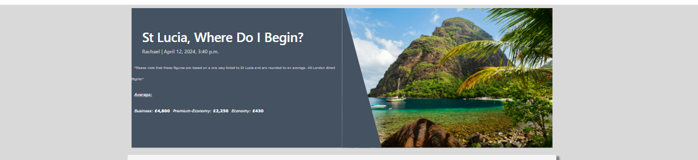

# Retreat Right

## Introduction

Welcome to Retreat Right. A travel blogging website based solely on my personal reviews and recomendations upon where I've travelled to and where I think that other people would like. Users can sign up, sign in, read already created blog posts, comment on posts and create and update their own profile.

This site is based around user authentication and user interactivity to create a feeling that the user is safe and in control whilst on this website.

[Visit the Website Here](https://retreat-right-89a95f86c8e5.herokuapp.com/)

[Visit this projects repository here](https://github.com/RachaelBull/retreat-right)

# UX

## User Stories

*First Time User:
- As a first time user, I would want to be displayed a visually attractive landing page that is descriptive.
- As a first time user, I would want to be shown a few posts on the landing page with catchy titles and excerpts to tempt me to read more.
- As a first time user, I would like to be able to sign up for an account with Retreat Right.
- As a first time user, I would want the landing page and all pages to show clear nav links so that I can navigate around the website easily.

*Returning User:
- As a returning user, I would want to be able to log into my account easily using the nav links at the top of the page.
- As a returning user, I would want to open up posts and be able to read comments and comment on the posts.
- As a returning user, I would want to be able to create my own profile via the profile link and update it freely.

## User Stories Table

| id  |  Content | Label |
| ------ | ------ | ------ |
| [1](https://github.com/RachaelBull/retreat-right/issues/1) | As a Site User, I can click on a post so that the content will be displayed for me to read. | Must Have |
| [2](https://github.com/RachaelBull/retreat-right/issues/2) | As a Site User/Admin I can see the comments on the posts so that I can be involved in the conversations. | Must Have |
| [3](https://github.com/RachaelBull/retreat-right/issues/3) | As a User I can register for an account so that I can have access to the sites features. | Must Have |
| [4](https://github.com/RachaelBull/retreat-right/issues/4) | As a User/Admin I am able to comment on posts so that I can be involved in the conversations. | Must Have |
| [5](https://github.com/RachaelBull/retreat-right/issues/5) | As a User I am able to modify or delete my own comments so that I can make a decision upon what I would like to be involved in. | Should Have |
| [6](https://github.com/RachaelBull/retreat-right/issues/6) | As an Admin I can create, read, update and delete posts so that I can keep my site to my liking. | Should Have |
| [7](https://github.com/RachaelBull/retreat-right/issues/7) | As a User I can create drafts so that I can come back and finish my content at a later time | Must Have |
| [8](https://github.com/RachaelBull/retreat-right/issues/8) | As an Admin I can approve users comments so that I can keep track of the content being posted onto the site | Could Have |
| [9](https://github.com/RachaelBull/retreat-right/issues/9) | As a User I can like posts so that I can express my interest in the content | Could Have |
| [10](https://github.com/RachaelBull/retreat-right/issues/10) | As an Admin I can delete users so that I can manage who has accounts on the site | Could Have |
| [11](https://github.com/RachaelBull/retreat-right/issues/11) | As a User I can view posts from the homepage so that I can choose which one I would like to read. | Must Have |
| [12](https://github.com/RachaelBull/retreat-right/issues/12) | As a User, I am able to click on the about page link so that I can read about the website. | Must Have |
| [13](https://github.com/RachaelBull/retreat-right/issues/13) | As an Admin, I can create and update content on the About page to keep the content up to date and relevant. | Must Have |
| [14](https://github.com/RachaelBull/retreat-right/issues/14) | As a site owner, I can store contact requests from the form so that I can view them whenever desired. | Should Have |
| [15](https://github.com/RachaelBull/retreat-right/issues/15) | As a site viewer/user I can fill out the contact form so that I can get in direct contact with the site owner. | Must Have |
| [16](https://github.com/RachaelBull/retreat-right/issues/16) | As a site user, I can view my profile so that I can read and update my profile. | Could Have |

## Strategy

My aim is to bring in people that are serious and passionate about trying new things and wanting to see the world from other people's views and angles. In order to do this I took a mental note that I would have to keep my target audience in mind at all times in order to achieve this goal.

My intended audience is:
- People of any age in my posts are adventurous, spontaneous and diverse.
- Individuals that are passionate about travel and adventure.
- People who love to try new things and are keen on reading from other peoples experiences.

How I will draw in my audience:
- I will aim to try and captivate my audience by producing well written, well formatted, relevant and intriguing posts to create a feel as though the user was there with me.
- I will regularly update my posts to keep users entertained and to keep fresh content flowing through the website.

## Scope

This website will consist of the following features:

- A clear and attractive landing page
- Readable nav header links
- Further link prompts over the landing page
- An option to register for an account
- An option to sign in to an account
- Allow the user to create and update their own personal profile
- Allow the user to comment on posts
- Allow the user to edit their comments
- Allow users to delete their comments
- Allow users to open and read posts
- Allow users to open and read the about page

## Wireframes and Design

This website project was carefully planned in terms of design and features for mobile view and desktop view using the wire frames below:

*The Home page on desktop*

*The About page on desktop*

*The Profile page on desktop*

*The Post page on desktop*

*The wireframes in Mobile view*

## Flowchart

The logic of this website was planned out using a flowchart using LucidChart. This was made to act as a set of instructions and a reminder of what features require certain authentication. This was to ensure that my website was still accessible and interactive for people without registering for an account, but made more accessible and offered more features to people that did have an account with Retreat Right.

## Data Model Plans

The models used across this website were also carefully planned out before starting the project to be able to code and develop with more ease when it came to implementing the models into my project. This is because the diagrams below act as a visual set of instructions on how to go about structuring the models:

Here, you can see which models are planned to be linked to others, and which fields are to be implemented for the best results. You can also see which fields within the models plan to use fields with a Foreign Key.

# Data Models

Here I will explain in more depth what each model will do and is expected to do.

**User Model**

- The user model is an automatically generated default model from Django Authentication
- This model comes with user login authentication prompting the user to log in to their account or to sign up for an account
- The user model has a one to many relationship with the user post model. This is because the user can have many posts (in this websites case that would be me) but the post has only one author, the posts are authenticated to see if the user is logged in and has an account
- The user model will link anything such as comments, profiles, posts etc to one user, so that only the content the user has inputted and provided may be shown/ available to edit to that user depending on the circumstance.

**Post Model**

- The post model is a one to many relationship with the user model and the post model as the user is able to have many post but each post has only one author
- The author field in this model is used as a Foreign Key that will be the main link to a user for authentication
- This model will give the creator (me in the website's case) fields to fill in from the admin panel in order to create a post. This consists of; A title field, a slug field, a content field, a ticket price field, a status field, an excerpt field, a created on field and an updated on field.

**Comment Model**

- The comment model has a many to many relationship regarding the post model but a many to one relationship in regards to the user model
- This model will use the post and author as the foreign keys for verification of a user to link the user to any comments they have made throughout the website
- The user has full ability to fill out the content of the body field provided to leave comments
- A time and a date will be automatically generated whenever the user leaves a comment to signify when the comment was left
- This model contains an approved field which essentially will send the users comment off to the admin panel for approval before it is left in the thread onto the post

**About Model**

- The about model acts as an additional information page about the user and the website itself
- The about model has fields that only the superuser can fill in and edit from the admin panel to keep the contents of this page to a high standard and free from outside customisation

**Profile Model**

- The profile has a one to one relationship with the use model as the user can only have one profile and that specific profile can only belong to one user
- The profile model consists of a name field, an email field, and a bio field which the user is able to create and update freely
- The contents updated by the user will stay filled in in the form in order for the user to come back to and read/update

## Colour Scheme

The colours used in this project are: rgb(115, 115, 115) (Light Grey), Whitesmoke, #4A4A4F (Darker Grey), rgb(0, 255, 153) (Light Green), White, rgb(217, 217, 217) (Slightly Darker White), #445261 (Medium Grey).

I chose these colours to create an atmosphere for the user straight into opening the landing page. With this website project being based around traveling and the idea of getting away and retreating away from reality, I thought it would be more suitable for the colours to reflect what I expect users would think about when going away somewhere to retreat. For example, somewhere bright and sandy (white), somewhere with beautiful beaches and clear blue water (blue) and exotic trees only the hot climates could grow (green). 

The gray and off white colours were added in to create a more professional looking website to break up the bright colours in between the use of them on different pages.

## Font Used

The fonts that were chose for this project are:
  * Roboto
  * Lato
  * DM Sans
  * Lobster Two Sans
These fonts were all backed up using 'sans-serif' incase of any loading errors. These fonts were all used by imports from [Google Fonts](https://fonts.google.com/).

### List of Features

- A Home page displaying blog post snippets
- An About page displaying further owner informations
- A Contact form located within the About page
- A Login form
- A LogOut form
- A Sign Up form
- A Profile page
- A Profile form
- A Blog post page

## Features in more detail

# Home

*Logo*

Located at the top left of the navbar you will find an attractive logo split into two different styles and colours to recreate those colours in the user's head as to what they would expect to see if they were away abroad somewhere. The text used was big but not too big with a small letter spacing style used, this is to make it clear that it is the name of the website but not too big that it takes up a significant part of the page.

*Nav Bar - Links*

Just to the right of the logo text in the desktop/large tablet view you will see the navigation links to the different apps and pages across this website. The text was set to uppercase here to draw the user into looking at the navbar, I thought that this also created a nice looking design for the rest of the nav bar as the colour of the nav bar was set to light, making it look a little plain when lowercase text was being used. When in mobile view the navbar links become stored in a little three lined dropdown icon, making it easier and more visually appealing for the user to comfortably get around the website.

*Hero Image*

When arriving to the landing page, the user is greeted with a big beautiful image of the caribbean. This is what I image a person would picture straight away when thinking about a place to get away and retreat to, somewhere warm, hot and surrounded with breathtaking views. This instantly attracts the user to stay on the page as the hero image sends a clear message that this website is about traveling.

*Hero Cover Text*

Underneath the nav bar to the far right you will find some text that changes upon the user's current situation. If the user is not logged in then the text will show as this: 'Please log in to access this site's full features.'
And if the user is logged in then the text will show as this: 'Signed in as <username>'
This gives the user the feel of a more personal approach as they are being addressed and acknowledged after their sign in, and if the user isn't signed in it acts as a little reminder. For new users this gives them that extra little encouragement to create an account with the website to access the features provided to logged in users.

*Post Snippet Cards*

A brief snippet of the posts displaying an uploaded picture can be located directly underneath the hero image. These are split into 3 per page and change upon the width and height of the user's device view. Here the 3 cards will display a post title, a post excerpt, a post picture and a created on date. This acts as a little teaser to the user to entice them to click onto the post and read more. The images represent each post in a bold way to again show the user what the rest of that post will be about. Underneath these postcards there is a button which controls which teaser posts are being displayed on that same page, a great feature to keep the content flowing but keeping the user onto their current page.

*Footer*

Directly underneath posts the user is presented with a footer that matches the styles of the header, this is more visually pleasing for the user as it is demonstrating consistency throughout the design and helping not to overcrowd the page too much with different designs. The footer contains a small bit of text stating the creator and purpose of the website. There are also two social media links in the footer to help the user get to know the creator. This also acts as good advertisement and gives the website that extra bit of a legitimate and professional feel.

# About

*Page Heading*

The top of the page has a big, bold uppercase heading to make it clear to users what this page will be about.

*About Content*

Directly underneath the page heading you will find a fairly large amount of text displayed for users to read. The nature of this text is to further inform the user on what this page and website was made for and who it was made by, giving extra information about the website owner.

*Contact Form*

Located underneath the about page heading and text the user will be displayed a contact form that they can fill out in order to get in touch with the website owner for any questions or messages that they would like to share and pass on. The user is prompted to fill out their name, email and message request before submitting. Upon submitting the user will be presented with a message at the top of the screen that acts as confirmation of the message sent.

# Profile

*Page Heading*

The top of this page is again presented with the consistent but basic styling of bold, uppercase and big text.

*Profile Form*

Directly underneath the profile page heading the user will find a profile form that the user can fill out to tell the owner of the website a little more about themselves. This will then be shown in the admin panel upon successful submission. The users inputted fields are saved and stored within the form whenever the user updates their profile using the submit button. Everytime the user successfully updates and creates their profile a confirmation message is displayed at the top of the page.

# Log Out

*Log Out Heading*

The top of this page is again presented with the consistent but basic styling of bold, uppercase and big text.

*Log Out Form*

Underneath the page header there is a form containing a button which the user would use if they wanted to continue with logging out of their account. The colours are continuous with the rest of the website's styling giving it a more professional and less confusing look. After the user has successfully logged out of their account a confirmation message will appear at the top of the screen.

# Sign Up

*Sign Up Heading*

*Sign Up Form*

Just above the Sign Up form there is some text containing a link back to the sign in page in case users that already have accounts have navigated themselves to this part of the website by accident.

Underneath the sign up page heading there is a form that prompts the user to fill out the fields in order to create an account with the website. This includes a Username field which requires input, an Email field which doesn't require input, a password field which does require input following the instructions below it, and another password field which confirms the above password was correct.

# Log In

*Log In Heading*

*Log In Text*

Underneath the Log In heading there is a short amount of text that contains a link to redirect any users to the sign up page if they have not yet made an account with the website.

*Login Form*

The login page also features a login form for the user to fill out in order to get access to more features of the website. The user is prompted to fill out their username correctly and their password. If either of these fields do not exactly match a user's details then access will be denied. Once the user has successfully logged in a message will appear at the top of the screen to act as confirmation.

# Blog Posts

The Blog Posts page consists of:

- A Post Heading containing a fun title explaining the nature of the post
- Small text underneath the heading advising the users of the current going prices on one way tickets across airlines
- A detailed image located to the right of the page header that acts as a way to pull the user audience in and entice them to wanting to visit there

- A full view of the post content with text dividers and use of boldness to give the page a more attractive look

- A comments and likes count located directly underneath the blog post which a logged in user can click. Upon clicking the heart icon the icon will turn red for that user and the number next to it will increment by 1, indicating that the current user has liked that post. If the user then clicks on that icon again then the icon will go back to its original state and the number next to it will decrease by 1.

- A comments section displaying comments and any unapproved comments made by the current logged in user
- A comments form for the current logged in user to fill in if they would like to leave a comment on that post. This consists of a body field which requires input in order to successfully submit.

- When the user leaves a comment a message will appear at the top of the screen
- When a user edits their comment a message will appear at the top of the screen
- When a user deleted their comment a message will appear at the top of the screen

# Agile Development

My Github Projects board acted as my agile tool for this project. This can be viewed [here](https://github.com/users/RachaelBull/projects/4/views/1).

## Epics

Epics were used within my Agile project to keep things smoother and simpler when in development. The epics are:
* Visitor
* User
* Site Admin

Each user story was split into 3 different priority groups using the labels:
* Must Have
* Should Have
* Could Have

*User Story Board*

## Testing

All in depth testing can be found [here](https://github.com/RachaelBull/retreat-right/blob/main/TESTING.md).

# Deployment

## The database

* Go to [elephantsql.com](https://www.elephantsql.com/) and log in/ create an account if you don't already have one.
* Click **Create New Instance** to start a new database.
* Provide a name for this, typically it would be your project name.
* Select the **Tiny Turtle (Free)** plan.
* Select the **Region** and **Data Center** closest to you, ensuring it's above 12 to run properly.
* Once created, click on the new database name, where you can view the database URL and Password.

## Heroku

* Log in to your Heroku account or create an account if you don't already have one.
* When you get to the dashboard, click 'New'.
* Select the 'Create New App' option.
* Create the app name and select your region.
* Finish off by selected 'Create App'.
* From the new app go into your **Settings**, click **Reveal Config Vars**, and set your environment variables.

Please note that Heroku does needs two files in order to deploy properly. These are:
* requirements.txt
* Procfile

You can install this project's requirments to have and develop in your own environment using this command line in your terminal:

* `pip3 install -r requirements.txt`

To further update the requirments file with your own insatllations in the future then you will need to run this command line in your terminal:

* `pip3 freeze --local > requirements.txt`

In order to create the Procfile you will need to input the following command into your terminal:

* `echo web: gunicorn app_name.wsgi > Procfile`

### Preparing the workspace

* Create an env.py, requirements.txt & Procfile in the main directory of your GitPod workspace using the above commands provided
* Add the DATABASE_URL value (found on your Database dashboard) and your chosen SECRET_KEY value to the env.py
* Import the env.py file in your settings.py file and add the SECRETKEY and DATABASE_URL file paths, ensuring your keep your secret key stored as a variable in the env.py file
* Make any necessary migrations: `python3 manage.py makemigrations`
* Migrate the data to the database: `python3 manage.py migrate
* Add the Cloudinary URL to the env.py file
* Add the Cloudinary libraries to the list of installed apps in settings.py
* Load fixtures (if applicable): `python3 manage.py loaddata file-name.json`
* You should now be ready to run your Django App.

*Config Vars*

* SECRET_KEY - Of your own choice
* PORT = 8000
* DISABLE_COLLECTSTATIC = 1 - this will be removed further into development
* DATABASE_URL - Your ElephantSQL database URL

**Deploying your project to Heroku**

* Navigate to the top of the page and click on the 'Deploy' tab.
* Select 'Github' as your method of connecting your repository.
* Once linked, select 'Automatic deploys from' or 'Manual Deploy' Manual is recommended.
* Click on Deploy.
* Click 'Open App' to view the deployed site.

## Cloning

* Navigate to this or any github repository
* Find the green code button located at the top right corner of the page
* Select if you prefer to clone using HTTPS, SSH, or GitHub CLI and click the copy button.
* Go to Git Pod Workspace or any you prefer and navigate to "New Workspace".
* Paste the URL into the space provided.
* Press Enter to create your local clone.

## Forking

To make a copy of an original repository on your GitHub account in order to view and/or make changes without affecting the original owner's repository then you would want to use a forking method.
You can fork this repository by using the following steps:

* Log in to GitHub and locate the repository that you wish to use.
* Find the 'Fork' button which is located just above the 'Settings'.
* Select 'Create'.
* Once clicked, you should now have a copy of the original repository.

# Credits

* I was able to learn how to create the Pill looking border radius in CSS with the help of [this page](https://css-tricks.com/almanac/properties/b/border-radius/).
* The content used to create the St Lucia post was used from [this page](https://bluebaytravel.co.uk/blog/2024/02/natural-attractions-in-saint-lucia/).
* The content used to create the Las Vegas post was used from [this page](https://www.visitlasvegas.com/experience/post/day-or-night-five-reasons-its-always-time-for-vegas/?src=goog_prospec_vob_int_vob_plan_td)
* More content was added to the Las Vegas post using [this page](https://www.free-attraction-reviews.com/usa/arizona/the-grand-canyon-arizona/ ).
* The content used to create the Costa Rica post was used from [this page](https://www.roughguides.com/costa-rica/eating-drinking/).
* The content used to create the Orlando post was used from [this page](https://www.thetimes.co.uk/travel/destinations/north-america-travel/us/orlando/orlando-n8s9x7hvd).
* More content was added to the Orlando post using [this page](https://www.timeout.com/orlando/restaurants/best-restaurants-in-orlando).
* The content used to create the New York post was used from [this page](https://www.lastminute.com/travel-inspiration/cultural-explorer/guide-to-new-york).
* The content used to create the Mauritius post used from [this page](https://www.roughguides.com/mauritius/).
* I was able to insert a big hero image onto my home page with help from [this page](https://bootstrapbrain.com/component/bootstrap-5-hero-image-section-example/#preview).
* The page that helped me expand my knowledge on how I would impliment the likes button and functionality into my project can be found on [this page](https://www.youtube.com/watch?v=xqFM6ykQEwo).
* All of the images used across this project were obtained from [Shutterstock](https://www.shutterstock.com/).

# Technologies

* [HTML5](https://en.wikipedia.org/wiki/HTML5) For the front end HTML code
* [Python](https://en.wikipedia.org/wiki/Python_(programming_language)) this was the main language used across this project
* [CSS](https://en.wikipedia.org/wiki/CSS) used for the custom styling
* [JavaScript](https://en.wikipedia.org/wiki/JavaScript) For some functionality of the webpage, mainly the comments
* [Summernote](https://summernote.org/) - form templates
* [Bootstrap](https://getbootstrap.com/) - responsive styling
* [Django](https://www.djangoproject.com/) - template
* Crispy forms Form templates
* [Cloudinary](https://cloudinary.com/) - uploaded image storage
* [Heroku](https://www.heroku.com/) - used to host the project
*  [Git](https://git-scm.com/) - used for version control
*  [elephantsql](https://www.elephantsql.com/) - database
*  [Github](https://github.com/) - storing the repository
*  [Google Fonts](https://fonts.google.com/) - fonts used across the website
*  [Font Awesome](https://fontawesome.com/) - used for the icons
*  [Gitpod](https://www.gitpod.io/) - development environment
*  [Balsamiq](https://balsamiq.com/) - used to create the wireframes
*  [Lucid Chart](https://lucid.app/) - used to create the flowchart and the model diagrams
*  [Nu Html Checker](https://validator.w3.org/nu/) - used to validate HTML Code
*  [jigsaw](https://jigsaw.w3.org/css-validator/) - used to validate the CSS code
*  [jshint](https://jshint.com/) - Javascript validator
*  [CI Python Linter](https://pep8ci.herokuapp.com/) - Validate the python code
*  [amiresponsive](https://ui.dev/amiresponsive) - to check responsiveness

# Acknowledgments

* I would like to thank my mentor Harry Dhillon for always helping me whenever I need it and always going above and beyond to help me solve my problems.
* I would like to thank the tutoring team for always helping me and taking the time to explain how to resolve things.
* The django walk through project was a big help for me for this project, It was nice to have something to refer back to in the content when I wasn't quite sure on some things.

# Bugs

* There is a current error showing in dev tools across all pages linked to the page not being able to find a favicon, after many attempts I could not get this to work so therefore I do not have a favicon for the page to find.
* There are not any more bugs that I am currently aware of.

# Future Implements

* There is so much more that I would like to do to this project in order to take it to the next level such as allowing the user to create a post, edit a post and delete a post without having to go into the admin panel.
* In the future I will also pay much more attention to the project board and try to update it in a much more timely manner.