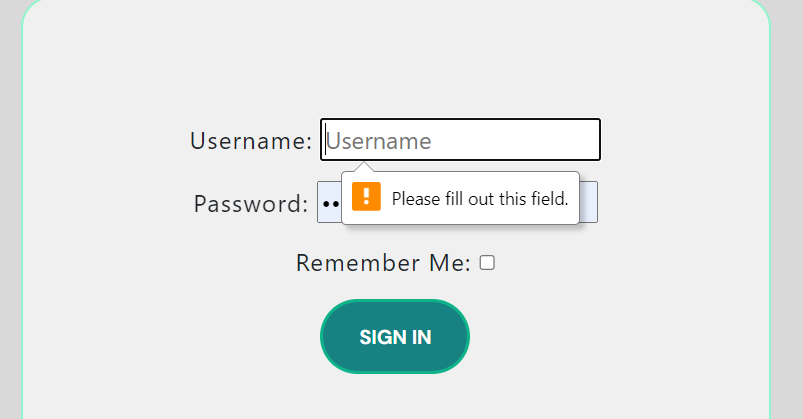
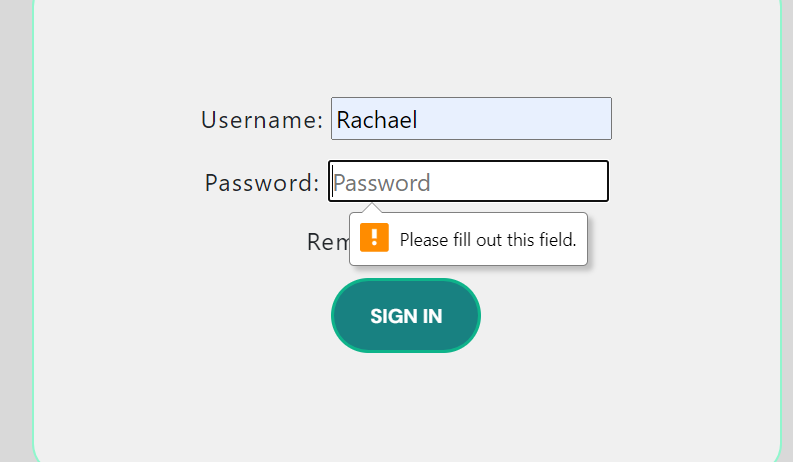
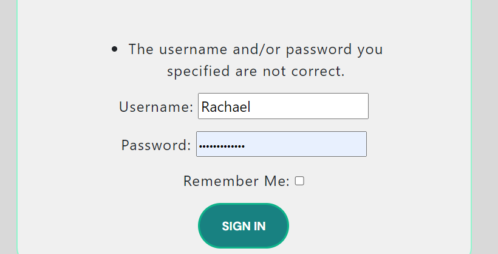
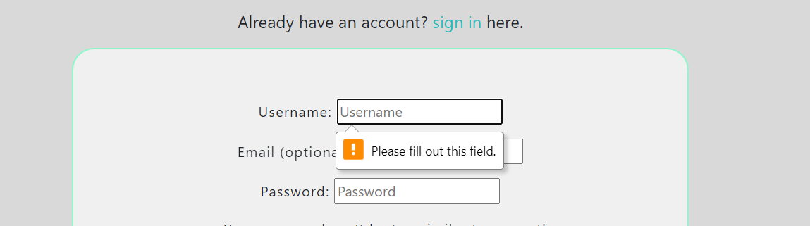
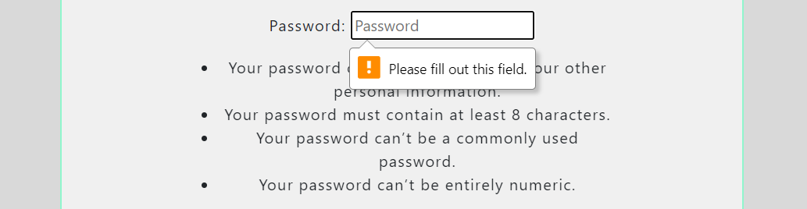

# Retreat Right - Testing

**All testing for this project has been done manually**

## Link testing

| Tests ran as a user | Actions | Outcome |
|:---|---:|:---:|
| The logo | Taken back to the home page upon clicking | Successful - Works as expected |
| Navigation Links | Able to view every page upon clicking | Successful - Works as expected |
| Log In Link | Takes the user to the Log In page and form | Successful - Works as expected |
| Log Out Link | Takes the user to the Log Out page and form | Successful - Works as expected |
| Sign Up Link | Takes the user to the Sign Up page and form | Successful - Works as expected |
| Home Link | Takes the user to the home page | Successful - Works as expected |
| About Link | Takes the user to the About Page | Successful - Works as expected |
| Instagram Footer Link | Takes the user to a seperate browser page | Successful - Works as expected |
| LinkedIn Footer Link | Takes the user to a seperate browser page | Successful - Works as expected |
| Post Snippet Links | Takes the user to the full blog post page | Successful - Works as expected |
| Sign In Link - Sign Up Page | Takes to the user to the Sign In page | Successful - Works as expected |
| Next Button (under post snippets) | Displays the next three post snippets to the user | Successful - Works as expected |

## Form testing

### Contact Form

| Tests ran as a user and superuser | Actions | Outcome |
|:---|---:|:---:|
| Contact Form - Name Field | The user is required to fill out this field before submitting | Successful - Works as expected |
| Contact Form - Email Field | The user is required to fill out this field correctly before submitting | Successful - Works as expected |
| Contact Form - Message Field | The user is required to have content in this field before submitting (cannot be left blank) | Successful - Works as expected |
| Contact Form - Submit Button | The form clears after the submit button is clicked | Successful - Works as expected |
| Contact Form - Admin Panel | The contact request is recieved in the admin panel | Successful - Works as expected |

**Contact Form - Name Field**

**Contact Form - Email Field**

**Contact Form - Message Field**

**Contact Form - Admin Panel**

### Log In Form

| Tests ran as a user | Actions | Outcome |
|:---|---:|:---:|
| Log In Form - Username | The user is required to add input to this field (cannot be blank) | Successful - Works as expected |
| Log In Form - Username | The user is required to use a correct username to be able to procceed | Successful - Works as expected |
| Log In Form - Password | The user is required to add input to this field (cannot be blank) | Successful - Works as expected |
| Log In Form - Password | The user is required to use a correct password to be able to procceed | Successful - Works as expected |
| Log In Form - Both | The user is required to fill out all fields correctly to continue | Successful - Works as expected |
| Log In Form - Button | The user is taken to the home page after correct input submission | Successful - Works as expected |

**Log In Form - Username**

**Log In Form - Password**

**Log In Form - Both (Correct Input)**

### Log Out Form

| Tests ran as a user | Actions | Outcome |
|:---|---:|:---:|
| Log Out Form - Button | The user is taken back to the homepage as a signed out user upon clicking | Successful - Works as expected |

### Sign Up Form

| Tests ran as a user and superuser | Actions | Outcome |
|:---|---:|:---:|
| Sign Up Form - Username | The user is required to fill out this field | Successful - Works as expected |
| Sign Up Form - Email | The user is not required to fill out this field | Successful - Works as expected |
| Sign Up Form - Password | The user is required to fill out this field in compliance to the instructions given | Successful - Works as expected |
| Sign Up Form - Password (again) | The user is required to fill out this field identical to the prior password field | Successful - Works as expected |
| Sign Up Form - Admin | Once a user is signed up they are added to the users in the admin panel | Successful - Works as expected |

**Sign Up Form - Username**

**Sign Up Form - Password**

**Sign Up Form - Password (again)**

